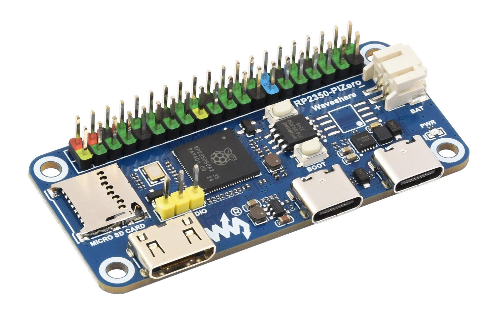
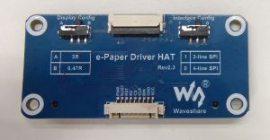

# 🚀 RP2350-PiZero with E-paper HAT Project

This project demonstrates the full capability of the Waveshare **RP2350-PiZero** development board integrated with an **e-Paper Driver HAT**. 📟✨

The source code in this repository is updated and synchronized with the latest version from the [official Waveshare e-Paper GitHub repository](https://github.com/waveshare/e-Paper), ensuring compatibility with the newest panel versions and drivers. It features a comprehensive driver library and a multi-display demo application (`Multi-epaper.ino`). 🛠️

---

## ⚡ Key Hardware Features

### RP2350-PiZero Development Board 🧠

- **Microcontroller:** RP2350B SoC (Dual-core ARM Cortex-M33 / Hazard3 RISC-V @ 150MHz).
- **Form Factor:** Compact Raspberry Pi Zero-sized board. 📏
- **Header:** Standard 40-pin GPIO (Raspberry Pi compatible). 🔌
- **Storage:** 16MB QSPI Flash memory. 💾
- **Extended Memory:** 8MB external PSRAM. 🧠
- **Connectivity:** 
  - USB Type-C (Power, Data, UF2 Boot). ⚡
  - HDMI / DVI Video Output via TMDS signaling. 📺
  - MicroSD card slot (SDIO/SPI). 📂
- **Power Management:** ETA6096 charger with Li-Ion battery support and TMI3112H buck regulator (3.3V). 🔋
- **🛒 Purchase:** [Waveshare Official Store](https://www.waveshare.com/rp2350-pizero.htm)

### E-paper Driver HAT 📟

- **Compatibility:** Supports various Waveshare SPI e-Paper panels. ✅
- **Interface:** Universal 4-wire SPI driver board. 🔗
- 🛒 Purchase: [Waveshare Official Store](https://www.waveshare.com/e-paper-driver-hat.htm)

---

## 🔧 Hardware Configuration & Pinout

The following table maps the RP2350-PiZero GPIOs to the 40-pin header for the e-Paper HAT connection: 📍

| Signal Name | RP2350 GPIO | 40-Pin Header | Description |
| :--- | :--- | :--- | :--- |
| **VCC** | 3.3V | 1, 17 | Power Supply ⚡ |
| **GND** | GND | 6, 9, 14, 20... | Ground Reference 🌑 |
| **DIN (MOSI)** | GPIO 11 | 19 | SPI1 Master Out Slave In 📤 |
| **CLK (SCK)** | GPIO 10 | 23 | SPI1 Serial Clock ⏱️ |
| **CS** | GPIO 8 | 24 | Chip Select (Active Low) 🎯 |
| **DC** | GPIO 25 | 22 | Data/Command Control 🕹️ |
| **RST** | GPIO 17 | 11 | External Reset 🔄 |
| **BUSY** | GPIO 24 | 18 | Busy Status (Active Low) ⏳ |
| **PWR** | GPIO 18 | 12 | Power Control (Active High) 🔋 |

---

## 📂 Project Structure

- `Multi-epaper/`: Main Arduino project directory. 📂
  - `Multi-epaper.ino`: Core entry point and display selector. 📄
  - `src/Config/`: Hardware-level abstraction (SPI, GPIO setup). ⚙️
  - `src/e-Paper/`: Comprehensive drivers for various Waveshare panels. 📟
  - `src/GUI/`: Graphics primitives (DrawLine, DrawRectangle, etc.). 🎨
  - `src/Fonts/`: Custom font definitions for text rendering. 🔠
  - `src/Examples/`: Test routines for individual displays. 🧪
- `docs/images/`: Visual references for the hardware components. 🖼️

---

## 🛠️ Software Development

This project is designed to be compiled and uploaded using the **Arduino IDE**. 💻

### 1. Arduino IDE Setup ⚙️
To support the RP2350-PiZero board, you must install the **Raspberry Pi Pico/RP2040/RP2350** core by Earle Philhower:

1.  Open the Arduino IDE. 📥
2.  Go to **File > Preferences**. ⚙️
3.  In the "Additional Boards Manager URLs" field, enter the following URL:
    `https://github.com/earlephilhower/arduino-pico/releases/download/global/package_rp2040_index.json` 🔗
4.  Go to **Tools > Board > Boards Manager...**. 📦
5.  Search for `RP2040` or `Pico` and install the latest version of **Raspberry Pi Pico/RP2040/RP2350** by Earle F. Philhower, III. ✅

### 2. Board Selection 🎯
Once the core is installed, select the correct board:
1.  Go to **Tools > Board > Raspberry Pi Pico/RP2040/RP2350**.
2.  Find and select **Waveshare RP2350 PiZero**. ✅

### 3. Compilation and Upload 🚀
1.  Open the `Multi-epaper/Multi-epaper.ino` file in the Arduino IDE. 📄
2.  Connect your RP2350-PiZero to your computer via USB-C. 🔌
3.  Put the board in **BOOT mode**:
    -   Press and hold the **BOOT** button. 🔘
    -   Press and release the **RESET** button. 🔄
    -   Release the **BOOT** button. (The board will appear as a USB mass storage device). 📁
4.  Select the correct Port in **Tools > Port** (usually an RPI-RP2 drive or a serial port). 📍
5.  Click the **Upload** button in the Arduino IDE. 📤

---

## 🖥️ Demo Functionality 📟
The `Multi-epaper.ino` sketch is currently configured for the **4.01" ACeP 7-color display** (`EPD_4in01f_test`). 🌈 To use a different display:
1.  Open `Multi-epaper.ino`. 📄
2.  Comment out the line `EPD_4in01f_test();`. 🚫
3.  Uncomment the test function corresponding to your display model (e.g., `EPD_2in13_V4_test();`). ✅
4.  Re-upload the code to the board. 🚀

---

## 🛡️ License
Refer to the individual source files in `src/` for licensing details (Waveshare permissive license). 📜
